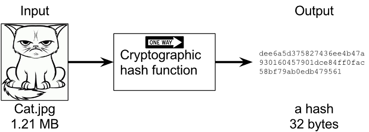

# Cryptography 101

[Modern Cryptography using GO](https://medium.com/@rafaelescrich/modern-cryptography-using-go-50e85f0f65af)

[Demo environment](https://cloudcontent.mybluemix.net/cloud/garage/dte/producttour/ibm-edge-application-manager-workload-management)

<dl>
  <dt>Encryption 101</dt>
  <dd>Khan Academy</dd>

</dl>

## 1. Hashing

[Hashing algorithms](https://theccpress.com/all-about-hashing-algorithms-and-how-they-work/)

A hash algorithm compresses data to a specific size. Hashes enable computers to easily compare or identify files or databases. Instead of going through the entire data in its original form, they just compare the hash values. Hashing can be applied to storing passwords, computer graphics, SSL certificates, and many other functions.

The defining features of hashing are irreversibility and uniqueness. Once a piece of data has been hashed, you cannot reverse the project. Also, you will never get the same hash values when hashing two different pieces of data. If two exact hashes are found for two distinct pieces of data, this occurrence is called “hash collision,” and such an algorithm is useless.

### Demo

We're going to take you through a demonstration of Hashing Capabilities with Go language 

Suppose you agree to pay $500 for rent, you send a message to your landlord (Bob) but a bad actor (Eve) changes the amount to $5,000. 

How can Bob tell which message is valid?

[Lab 1 - Hashing](https://go.dev/play/p/8XOtLqauDp1)

## 2. Encryption

### 2.1 Symmetric Key Cryptography

It’s a cryptography system that the same cryptographic key is used to encrypt and decrypt the content that we want to protect. This key is also known as shared secret that needs to be exchanged between the people that want to transmit information in a secure way. The drawback in this system is that anyone that possess the shared secret can decrypt and access the secret information.

We are going to demonstrate this scenario using a **Go playground** example.

[Lab 2 - Symmetric encryption](https://go.dev/play/p/7xMZv1OrOWF)

### 2.2 Public-key cryptography

It’s a cryptographic system that uses pairs of keys, one public key that can be distributed and one private key that must be known only by the owner. With this private key the owner can sign a message or cipher. 

The signing of a message can be later verified by others users in possession of the public key of the signer, this way they can assure that the message was really sent by the owner of the private key corresponding to the public key. In the same way, the users in possession of the public key can cipher a message that only the user that have the corresponding private key can decipher. This way make more secure the exchange of private information because the users do not need to exchange the secret key in an insecure channel, which is a big problem in symmetric encryption. 

**Public-key cryptography** is the foundation of today PKI, that means Public Key Infrastructure which runs all secure information in the internet including digital certificates in our browsers and webpages that we access everyday.

See the following example in **Go Language**:

[Lab 3 - Public key cryptography](https://go.dev/play/p/8WdoyET4599)
